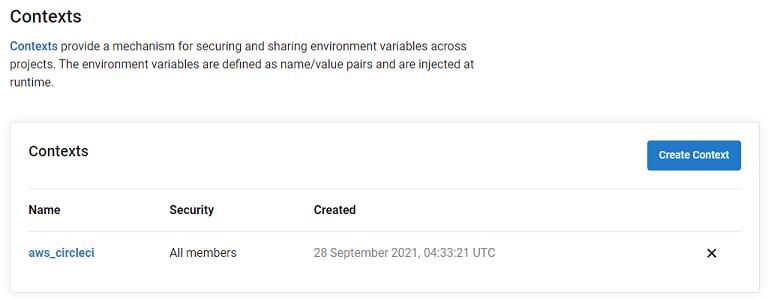
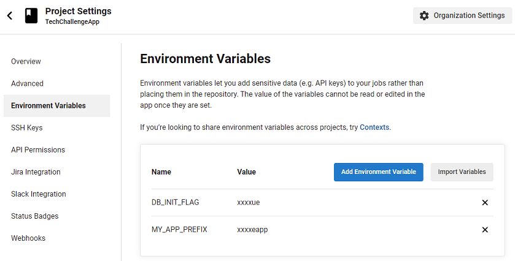
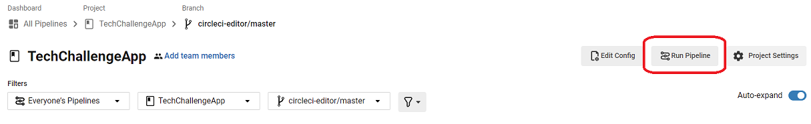

# Servian DevOps Tech Challenge - Assignment

## Overview

This is the Servian DevOps Tech challenge assignment. Servian provides the Tech Challenge to potential candidates, which focuses on deploying this application into a cloud environment of choice. More details about the origial application can be found in the [document folder](../doc/readme.md)

## GitHub repository

[kaiailan/TechChallengeApp](https://github.com/kaiailan/TechChallengeApp)

## Solution Architecture

### AWS Deployment


- The solution uses AWS for deployment environment:
    
    - 2 Availability Zones for HA
    - 1 public & 1 private subnets in each Availability Zone for network isolation of frontend and backend(DB instance).
    - ECR stores docker images built by pipeline
    - ECS Fargate as frontend service provides auto-scaling groups in 2 AZs. 
    - RDS postgresql (10.7) as database service also crosses 2 AZs for HA purpose. 
    - Application load balancer listens to port:80 for http requests from internet and forwards to the healthy containers under port:3000 managed within cluster. 
    - System manager parameter store is used to store environment variables for deployment to prevent expose them in deployment process.

### CI/CD Pipeline

- CircleCI pipeline is created to:

    1. Be triggered by code commition/changes
    2. Pull the lastest version from GitHub repo
    3. Build release packs 
    4. Make docker image
    5. Push it onto AWS ECR repo
    6. Deploy all the relevant infrustructure into AWS (IaaC: CloudFormation)
    7. Return URL of deployed app for test/visit

- Pipeline config file: [../.circleci/config.yml](../.circleci/config.yml)

```sh
./cfn
├── client-sg.yaml
├── cluster.yaml
├── rds-postgres.yaml
├── service-cluster-alb.yaml
└── vpc-2azs.yaml
```

- CloudFormation templates: [../cfn/](../cfn/)

## Prerequisites

1. GitHub account and access
    - Be able to fork this repo
    - Be able to clone code to local pc for better code review and amendment purpose.
2. CircleCI account and access
    - Import project from GitHub with the account in No.1 above.
3. AWS account and access
    - IAM User with AdministratorAccess (arn:aws:iam::aws:policy/AdministratorAccess)
    - Access keys for CLI, SDK, & API access
    - ECR Private repository usage

## Instructions for provisioning

### GitHub Setup

1. Fork this project to your own repo

### AWS Environment Setup

1. Use the correct IAM user sign in to the console

2. Generate access key for CLI, SDK, & API access
    - My Security credentials -> Create access key
        - download the .csv file or keep the key pair in a safe place.

    

3. Setup environment variables in Parameter Store
    - techchallengeapp-VTT_DBUSER
        - AllowedPattern: ^[a-zA-Z0-9]*$
    - techchallengeapp-VTT_DBPASSWORD
        - AllowedPattern: ^[a-zA-Z0-9]*$
    - techchallengeapp-VTT_DBNAME
        - Value: app
    - techchallengeapp-VTT_DBPORT
        - Value: 5432
    

4. Get AWS_ECR_ACCOUNT_URL
- The URL for your default private registry is `aws_account_id.dkr.ecr.region.amazonaws.com`.
- The format is `${YOUR_ACCOUNT_ID}.dkr.ecr.${YOUR_DEFAULT_REGION}.amazonaws.com`
- It also can be found in ECR console page when you are tring to create a new repo.

5. Environment Check 
- Assume that the solution will be deployed to an empty cloud subscription with no existing infrastructure in place.
- Atherwise please check if the following resources are in use or in same name:
    - VPC: 10.0.0.0/16
    - RDS DB instance: techchallengeapp-dbinstance
    - ECS Cluster: techchallengeapp-cluster
    - ECS Service: techchallengeapp-service
    - Container name: techchallengeapp-container

### CircleCI Setup

1. Import project from GitHub 
2. Create Context in Organization Settings
    - Context name: `aws_circleci`
        
        
        - Environment Variables:
            - AWS_ACCESS_KEY_ID
            - AWS_SECRET_ACCESS_KEY
            - AWS_DEFAULT_REGION
            - AWS_ECR_ACCOUNT_URL
            Note: the values for above are from `AWS Environment Setup`
        

3. Create Project Environment Variables
    - Name: `MY_APP_PREFIX`
    - Value: `techchallengeapp`
    

### Deployment

1.  Run Pipeline from CircleCI portal for the first time
    As it's the first deployment, it will create the database, table, and insert demo datas.
    - 
    Note: It could take up to 40mins to 1 hour for the first run.
2.  Check the result, if there's no error, you should be able to access the app through AWS alb URL that printed in the last step of pipeline.
    - 
    - Todo: The default region in URL is marked by circleci automatically. Will create a URL for convenientce in later version.
3.  Change the default parameter 'DBTableInit' from `true` to `false` in [../cfn/service-cluster-alb.yaml](../cfn/service-cluster-alb.yaml)
    - 
    - And submit the changes to GitHub repo. 
    - It will trigger the pipeline deploy the new changes to cloud again. 
    - So that the appdata will not be removed by the DB init task that created in the first run.

### Verification

1.  Enter the URL(change the ******* part to your default AWS region) printed from the last run to a webbrowser.
    - expect:

    
    
2.  Input `it support` in textedit area, and click `+` button
    - expect:

    

## Todo

1.  Optimise the workflow in pipeline, support execute independant cfn templates in parrallel.
2.  Looking for a secure way to pass on the environment variables to AWS in pipeline other than input them manually.
3.  DB initialization is not ideal, need to find another way to do it.
4.  Separate cleanup pipeline to destroy any stacks

##

## Finally

- It's quite a project. I was enjoying the whole process of figuring it out.
- Any issues, please feel free to let me know.
- And thanks for your support.